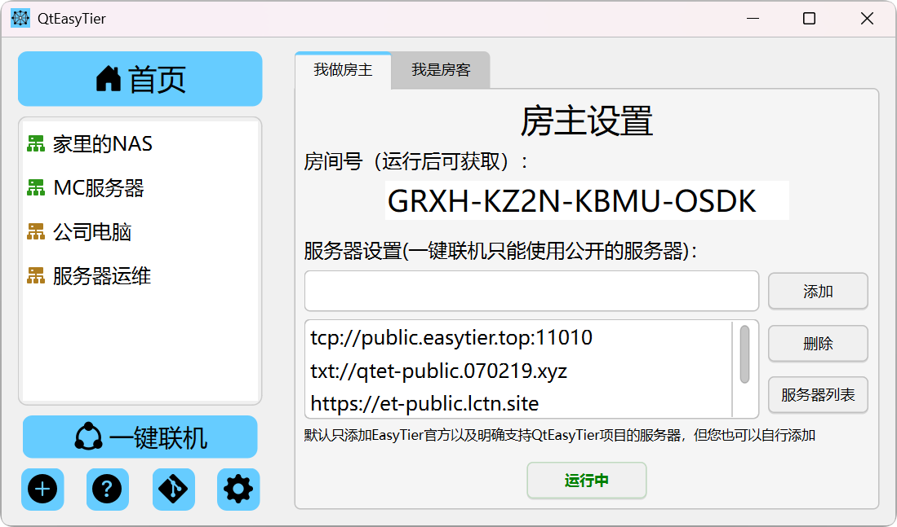
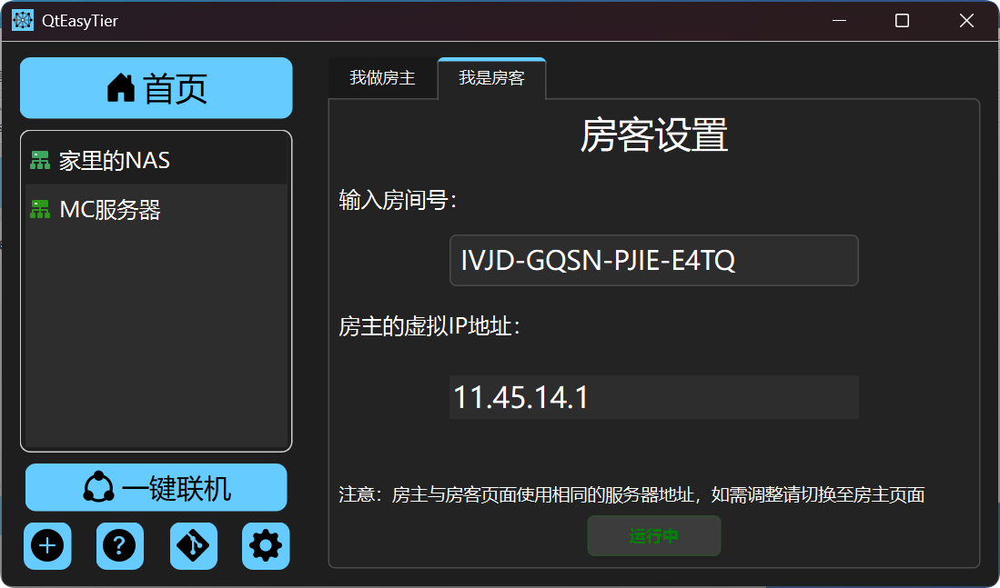

# 帮助文档

## 快速上手

如果你是第一次使用本项目，且没有接触过 EasyTier 相关工具, 这个部分可以帮助你快速上手使用，轻松组建你的虚拟网络。

### 1. 安装 QtEasyTier

- 前往Release界面下载最新版本的 QtEasyTier 的最新版本
  - ps：目前暂不提供安装程序，下载后解压即可使用

### 2. 一键联机

*ps. 一键联机是QtEasyTier1.1.0新出的功能，请先升级程序到新版本*

- 打开软件，点击左下角的一键联机按钮
- 房主可选添加服务器，然后点击运行网络按钮
- 网络成功运行后会生成一段房间号, 将此房间号发送给其他用户，其他用户将使用此房间号加入网络

- 房客先在房主界面选择相同的服务器
- 然后在房客界面输入房间号，点击开始运行按钮
- 联机成功后将显示房主虚拟IP地址，使用此IP即可联机

### 3. 创建网络配置

- 打开后，你会看到主界面，点击左下角的加号创建一个新的网络配置

- 如果你想创建一个网络，在网络配置窗口中输入用户名、网络号、密码等基本信息，相同的网络号和密码在连接有共同的节点（服务器）时，即可组成虚拟网络网络。
  -  注意：网络号和密码是他人加入组网的凭证，请尽可能设置复杂，务必妥善保管
  
- 服务器地址：默认已经预置了et官方的公共服务器地址，你可以直接使用，也可以添加其他服务器地址，支持多服务器
  - 注意：如果无法访问et官方服务器，你可以尝试使用其他服务器（在哪找公共服务器，加入Et交流群！）或者使用内网穿透邪修
  - 服务器地址的格式一般为 ：协议://地址:端口号，如默认的官方服务器所示，协议一般填tcp或者udp。
  - *为什么去中心化组网仍然需要一台服务器？因为你需要一台可以直接连接的具有公网ip的服务器作为加入网络的入口，但在加入组网后只要保证和同虚拟网内任意一个设备有p2p连接即可保证你不掉线，不一定依赖服务器维持连接。*
  

- 然后，您就可以点击 "运行网络" 按钮启动网络连接，在运行状态窗口可以查看加入网络的节点列表。
  

- 如果出错，可以在运行日志窗口查看错误信息，进行排查和解决。

- 此外，QtEasyTier允许你创建多个网络配置，每个网络配置可以独立运行，互不干扰，再您了解更多EasyTier的相关知识后，您可以根据需要在高级设置页面自定义网络配置，实现更多功能。

## 开机自启与网络自动连接

- 如果你的组网配置需要长期在线，建议在设置页面将QtEasyTier设置为开机自启，同时开启自动连接，这样在开机后即可自动加入网络。

- 设置自动连接后，UI页面启动前，QtEasyTier会自动尝试连接已保存的网络配置，这个过程会花费一定时间，请耐心等待。此外，开机自启时，QtEasyTier会在后台运行，在任务栏中找到QtEasyTier的图标，点击右键选择“显示主界面”即可查看运行状态。
